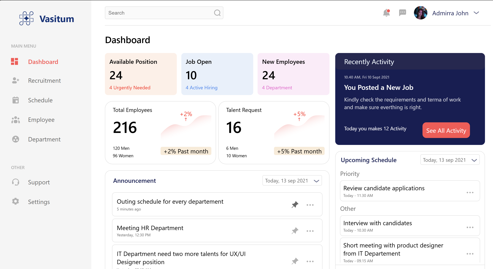

# URL Shortener

A react based responsive dashboard webpage (web and mobile).


</div>


## Installation Instructions

1. Clone the repository:

   ```bash
   git clone https://github.com/vedansh2001/Shoshin-Tech-.git
2. Navigate to the backend folder:

   ```bash
   cd Shoshin_Tech
3. Install the dependencies:

   ```bash
   npm install
4. Start the frontend server:

   ```bash
   npm run dev
5. 
## Usage
Once the frontend server is running, open your browser and go to:

   ```bash
   http://localhost:5173
   ```


## Screenshots


## Live Demo
Live Deployed URL

```bash
https://shoshin-tch.vercel.app/
```